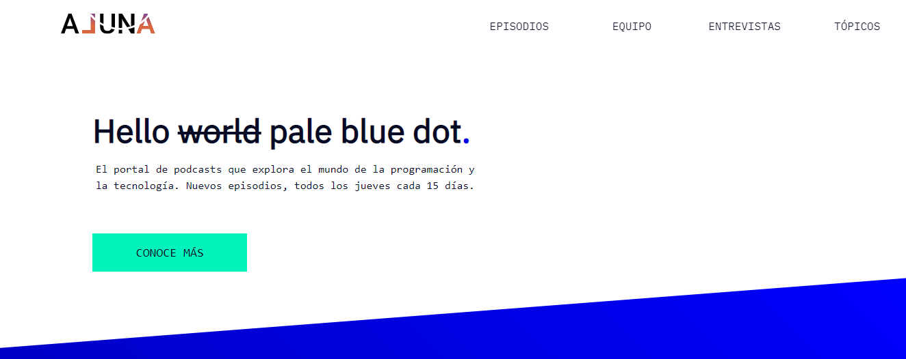

# Aluna - Web Podcast

<h3>Aluna is a web, responsive one-pager. It shares science content and cosmos-related wisdom, plus two inspiring Spotify playlists. Showcasing skills in the following:</h3>

<h4>Technologies</h4>
<ul>
  <li>HTML5</li>
  <li>CSS3</li>
</ul>

<h4>Additional</h4>
<ul>
  <li>Breakpoints</li>
  <li>Flexbox & Grid</li>
</ul>

* Spanish is its current language. Future iterations will support english as practice using JS

<h4>Sections</h4>

As all web pages, this one has the following:

<ul>
  <li>Header: Contains the logo</li>
  <li>Navigation bar. (Modified according to breakpoint)</li>
  <li>Main, which contains 6 sections:</li>
    <ul>
      <li>Sección 1: Titulo y explicación</li>
      <li>Sección 2: Episodios</li>
      <li>Sección 3: "De dónde venimos"</li>
      <li>Sección 4: Científicas</li>
      <li>Sección 5: Temáticas</li>
      <li>Sección 6: Call to Action</li>
    </ul>
  <li>Footer</li>
</ul>
 

